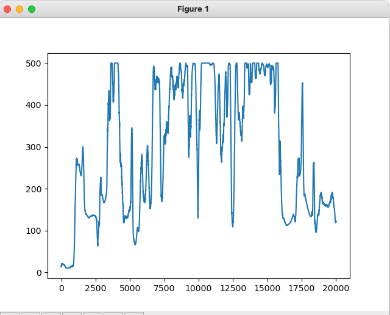

# Deep Q-Network (DQN) Implementation on Gym CartPole

This project implements a Deep Q-Network (DQN) to train an agent in the CartPole environment from OpenAI's Gymnasium. The objective is to achieve stable training performance by tuning hyperparameters and managing target network updates.

**Environment:** [CartPole-v1](https://gymnasium.farama.org/environments/classic_control/cart_pole/)

## Project Overview

The agent shows promising performance in reaching near-max rewards but struggles with consistency, especially in later training epochs. The agent initially showed rapid improvement, reaching rewards over 250 due to Q-value overestimation. Around 4000 epochs, the agent achieved the maximum reward of 500 across multiple evaluation points (each representing a rolling average of 100 episodes), indicating consistent performance over about 300 episodes. However, stability remained an issue as rewards fluctuated significantly in later training epochs.

## Observations on Stability and Soft Updates

A **soft update** mechanism was used, updating the target network at each learning step. While this approach allows for smoother transitions, it introduced instability in later stages of training:
- **Continuous Parameter Drift**: Frequent updates to the target network caused slight shifts in Q-values, leading the agent to oscillate between near-optimal and suboptimal policies.
- **Accumulation of Small Errors**: Small cumulative errors introduced by continuous updates prevented the agent from fully consolidating an optimal policy, resulting in fluctuating rewards.
- **Unstable Long-Term Behavior**: Although the agent achieved 500 reward points at various intervals, further updates led it to "forget" effective policies temporarily, impacting consistency.

## Exploration Strategy

Exploration was decayed at the episode level, as action-level decay within episodes destabilized learning. The chosen strategy helped the agent gradually shift from exploration to exploitation, improving learning stability.

## Potential Improvements

Future work could experiment with:
- **Reducing Soft Update Frequency** to every few hundred steps.
- **Lowering the Soft Update Rate (τ)** to minimize instability.
- **Switching to Hard Updates** at fixed intervals for more stable training phases.

---

   
  
  
Learned Rewards

