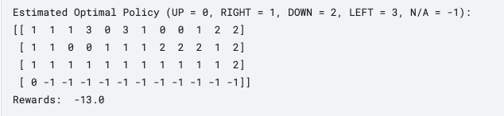

# QDN implementation for Gym CartPole Simulation
#### Vanilla QDN Implementation with Gym CartPole https://gymnasium.farama.org/environments/classic_control/cart_pole/
Was able to get client learn perfectly how to get over the edge (bottom line - first element is starting point and last element is target, and rest
of elements in bottom line are fail states)
Below is also print out of the policy that agent learned from Q-Table. As shown, optimal rewards = -13 which is perfect to start from start state
(1st element in bottom line), go up and right all way to last element and then go down to final state (last element in bottom line) and get penalized -1
for every step.

I coded Q_TABLE_Agent class to be free from environment dependency. That is, the class can be used with any other environment without any changes.
Notice all gym environment related calls are located in main.

   
  
  
Learned Policy

