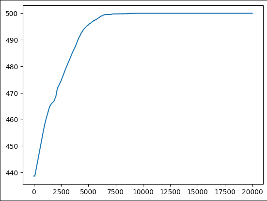

# Function Approximation implementation for Gym CartPole
#### Simple script to demonstrate function approximation with Gym CartPole simulation https://gymnasium.farama.org/environments/classic_control/cart_pole/
state vector is concatenated with discrete action and RBF was used to transform state-action into feature vector.  
Agent was able to learn and reached consistent 500 rewards (steps).  
Below is plot of agent rewards during learning process.

  

  
  
Learned Rewards

