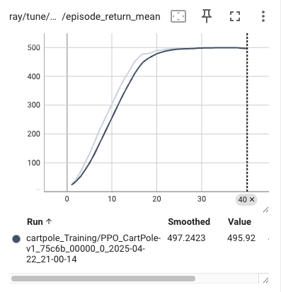
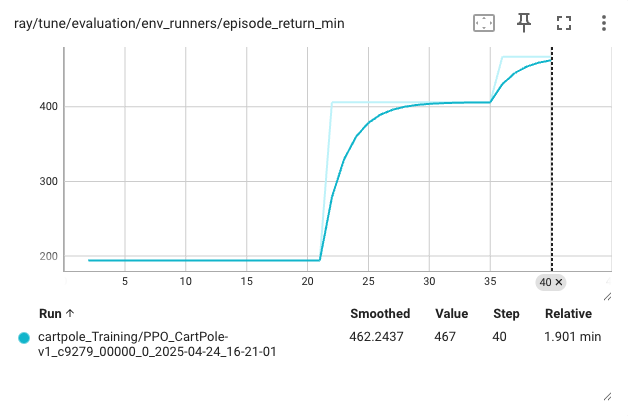
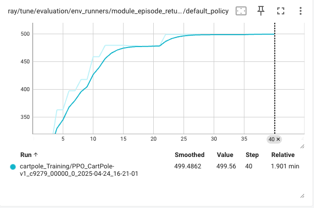

# CartPole-v1 with PPO using Ray RLlib

## Table of Contents
- [Introduction](#introduction)
- [Setup](#setup)
- [Training](#training)
- [Results](#results)
- [Viewing Results in TensorBoard](#viewing-results-in-tensorboard)
- [Conclusion](#conclusion)

## Introduction
This project demonstrates the training of a Proximal Policy Optimization (PPO) agent on the [CartPole-v1 environment](https://gymnasium.farama.org/environments/classic_control/cart_pole/) using [Ray RLlib](https://docs.ray.io/en/latest/rllib/index.html). CartPole-v1 is a classic reinforcement learning benchmark where the agent must balance a pole on a cart by applying left or right forces. The goal is to maximize the episode return, with a maximum score of 500. This README provides a comprehensive overview, including setup, training configuration, and an in-depth analysis of the training results.

## Setup
To run this project, you need Python (version 3.7 or higher) and Ray RLlib installed. Install the required dependencies using pip:

```bash
pip install ray[rllib]
```

Ensure you have [PyTorch](https://pytorch.org/) installed, as the code uses the "torch" framework for training.

## Training
The training is configured using Ray RLlib's PPOConfig, with the following key parameters:

- **Environment**: CartPole-v1
- **Framework**: PyTorch
- **Discount Factor (gamma)**: 0.99
- **Learning Rate (lr)**: 0.0001
- **Entropy Coefficient**: 0.02 (to encourage exploration)
- **Model Architecture**: Two fully connected layers with 512 units each, using ReLU activation
- **Training Batch Size**: 4096
- **SGD Minibatch Size**: 64
- **Number of SGD Iterations**: 5
- **Number of Environment Runners**: 1

The configuration is defined as follows:

```python
config = (
    PPOConfig()
    .environment("CartPole-v1")
    .framework("torch")
    .training(
        gamma=0.99,
        lr=0.0001,
        entropy_coeff=0.02,
        model={
            "fcnet_hiddens": [512, 512],
            "fcnet_activation": "relu",
        }
    )
    .update_from_dict({
        "train_batch_size": 4096,
        "num_sgd_iter": 5,
        "sgd_minibatch_size": 64,
    })
    .api_stack(
        enable_rl_module_and_learner=True,
        enable_env_runner_and_connector_v2=True
    )
    .env_runners(num_env_runners=1)
)
```

The training is executed using Ray Tune for 40 iterations:

```python
tuner = tune.Tuner(
    "PPO",
    param_space=config,
    run_config=tune.RunConfig(
        name="cartpole_Training",
        storage_path="ray_results",
        stop={"training_iteration": 40},
        verbose=1,
    ),
)
results = tuner.fit()
```

To run the training, save the provided code in a file (e.g., `train_cartpole.py`) and execute it:

```bash
python train_cartpole.py
```

The results are saved in the `ray_results` directory for analysis.

## Results
The training results, visualized in TensorBoard, provide insights into the PPO agent's performance over 40 iterations (approximately 1600 episodes due to a 40x multiplier). The following metrics are analyzed:

### 1. Episode Return Mean
- **Metric**: `episode_return_mean`
- **Description**: Tracks the average cumulative reward per episode.
- **Trend**: The smoothed curve rises steadily from near 0 to 495.92 by the 40th iteration. The raw data shows fluctuations, reflecting variability in episode performance.
- **Key Values**:
  - Smoothed Value: 495.92
  - Raw Value: 497.2423
- **Observation**: The agent achieves near-optimal performance, approaching the maximum score of 500, indicating successful learning to balance the pole for extended periods.

### 2. Episode Return Minimum
- **Metric**: `episode_return_min`
- **Description**: Tracks the minimum return per episode in each batch.
- **Trend**: The smoothed curve increases to 250-300 around the 20th iteration (800 episodes), then declines and stabilizes around 100-150. The raw data exhibits significant fluctuations.
- **Key Values**:
  - Smoothed Value: 131
  - Raw Value: 249.285
- **Observation**: The variability in minimum returns suggests that some episodes result in suboptimal performance, possibly due to exploration or policy instability.

### 3. Default Policy
- **Metric**: Likely a duplicate or alternative view of `episode_return_mean`.
- **Trend**: Mirrors the episode return mean, rising to 495.92 by the 40th iteration.
- **Key Values**:
  - Smoothed Value: 495.92
  - Raw Value: 497.2423
- **Observation**: This metric reinforces the agent's high average performance, consistent with the episode return mean.

### Summary Table
| Metric                  | Smoothed Value | Raw Value | Trend Description                                                                 |
|-------------------------|----------------|-----------|-----------------------------------------------------------------------------------|
| Episode Return Mean     | 495.92         | 497.2423  | Steady increase to near 500, indicating successful learning.                      |
| Episode Return Minimum  | 131            | 249.285   | Peaks at 250-300, then stabilizes at 100-150, showing variability in performance. |
| Default Policy          | 495.92         | 497.2423  | Mirrors episode return mean, confirming high average performance.                 |

### Analysis
- **Overall Performance**: The PPO agent effectively solves CartPole-v1, with the average return approaching the maximum of 500. A score above 200 is typically considered sufficient to "solve" the environment, and the agent's performance far exceeds this threshold.
- **Variability**: The minimum return's stabilization at 100-150 indicates that some episodes are less successful, possibly due to the entropy coefficient encouraging exploration or insufficient training iterations to fully stabilize the policy.
- **Training Stability**: The steady increase in average return suggests robust learning, but the fluctuations in minimum return highlight areas for improvement, such as hyperparameter tuning or extended training.


### Episode Return Mean


### Episode Return Minimum


### Default Policy



## Viewing Results in TensorBoard
To visualize the training results, use TensorBoard:

```bash
tensorboard --logdir=ray_results
```

This starts TensorBoard, allowing you to view the graphs in a web browser. The metrics discussed above are derived from these visualizations.

## Conclusion
The PPO agent trained on CartPole-v1 using Ray RLlib achieves near-optimal performance, with an average episode return of 495.92. However, the variability in minimum returns suggests that further optimization could enhance consistency. Potential next steps include:
- Tuning hyperparameters (e.g., learning rate, entropy coefficient, or model architecture).
- Extending training iterations to reduce variability.
- Experimenting with other RL algorithms or environments for comparative analysis.

This project serves as a robust example of applying PPO to a classic RL problem, with clear documentation and result analysis for reproducibility.