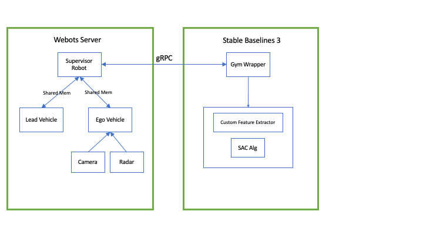

# Predictive Adaptive Cruise Control with Traffic Flow Optimization

A reinforcement learning project that trains an intelligent vehicle following system using Webots simulation and Ray RLlib. Unlike traditional reactive ACC systems, this agent learns to anticipate traffic patterns and optimize overall traffic flow through predictive following behaviors.

## 🚗 Project Overview

This project implements a novel approach to autonomous vehicle following that goes beyond simple distance maintenance. The RL agent learns to:

- **Predict traffic patterns** using historical observations
- **Dampen traffic waves** through strategic speed adjustments  
- **Optimize traffic flow** rather than just maintaining safe distances
- **Anticipate lead vehicle behavior** to prevent accordion effects

### Key Innovation

Traditional ACC systems react to immediate conditions. This system uses sequence modeling to learn predictive behaviors that improve overall traffic dynamics, enhancing driving smoothness and passenger comfort through reduced stop-and-go patterns.

## System Architecture
<div align="center">
  <br>
  
</div>


### Data Flow Architecture
<div style="width: 700%; max-width: 1000px; margin: auto;">
  

</div>


### Webots Simulation Flow
<div style="width: 400%; max-width: 600px; margin: auto;">
  

</div>

### Multi-Vehicle Simulation
- **Lead Vehicle**: Follows yellow lane markings with realistic driving variations (speed changes, braking, obstacles)
- **Ego Vehicle**: RL-controlled agent with radar, camera, and sensor fusion
- **Supervisor**: Coordinates simulation, handles resets, and manages communication

### Communication Pipeline
- **IPC Method**: gRPC for reliable real-time communication
- **Data Flow**: Webots → gRPC → Gym Environment → RLlib
- **Synchronization**: Stepped simulation with controlled timing

## 🧠 Learning Approach

### Observation Space
The agent observes both current conditions and historical patterns:
- **Current State**: Ego vehicle speed, distance to lead vehicle, relative speed between Vehicles, lead vehicle lateral offset
- **Historical Sequence**: Multi-step observation history for pattern recognition
- **Sensor Fusion**: Radar + camera data for robust perception

### Reward Design
Multi-objective reward function optimizing for:
- Safe following distances (collision avoidance)
- Speed matching with lead vehicle
- Lateral stability
- Smooth acceleration profiles

### Algorithm
- **Base Algorithm**: Soft Actor-Critic (SAC)
- **Architecture Enhancement**: Sequential processing for temporal patterns
- **Action Space**: Steering angle and target cruise speed
- **Training**: Experience replay buffer with prioritized sampling

## 🛠️ Development Status

**Current Phase**: Active development and experimentation

**Completed**:
- ✅ Multi-vehicle Webots simulation
- ✅ gRPC communication pipeline  
- ✅ SAC training implementation
- ✅ Basic reward function design
- ✅ Observation space definition

**In Progress**:
- 🔄 Reward function optimization
- 🔄 Hyperparameter optimization
- 🔄 Advanced reward shaping
- 🔄 Evaluation framework
- 🔄 Performance benchmarking

## 📈 Results and Analysis

The initial training iterations reveal that the agent prioritizes optimizing lateral distance at the cost of reduced initial speed, subsequently becoming trapped in a local optimum where it continues to optimize lateral distance while maintaining near-zero initial ego vehicle velocity.
The underlying issue appears to be a training convergence problem. When the agent successfully optimizes lateral distance, it typically attempts to optimize speed matching and safe following distance in subsequent iterations (usually after 4-5 training cycles). However, the episode termination criteria create a premature learning truncation. Specifically, episodes terminate when the speed difference between the 2 vehicles exceeds 25 km/h. Given the lead vehicle maintains a constant 40 km/h initial speed and the slow start of ego vehicle, this causes the termination condition to trigger within approximately 2 seconds, preventing the agent from adequately exploring alternative speed profiles.
The core issue is twofold: first, the shortened episode duration limits the agent's exploration opportunities, and second, the rapid episode termination may be reinforcing suboptimal policies by preventing the agent from experiencing the consequences of different speed strategies. Therefore I m currently trying either adjusting the termination criteria or enhancing the exploration strategy to ensure adequate policy space coverage during the limited episode duration.

To further debug and validate my assumptions, I segmented the rewards awarded in every step and plot it using tensorflow as show below:

**Tensor Flow Graphs**:
<div align="center">
    <br>
    
    
    
    
    
</div>

lead_lateral_dist_reward: Rewards given based on lateral offset of lead vehicle
lead_lost_reward: Rewards given if lead vehicle is still in ego vehicle front camera or it disappeared due to extensive lateral distance
lead_distance_reward: Rewards given based on how far is lead vehicle from ego vehicle
ego_speed: Mean ego vehicle speed per episode 
agent_episode_return_mean: Mean episode rewards

in my reward function design, the episode terminates if ego vehicle crash, distance between vehicles exceeds 25m, or difference between the 2 vehicle speeds exceeds 25 kmh (the reason of picking 25m and 25 kmh is my observation during calibration that radar readings become unreliable beyond those)
From lead_lateral_dist_reward and lead_lost_reward graphs, It is observed from initial learning iterations that agent is learning to reduce the offset between ego  and lead vehicles. The lead_distance_reward is confusing, it is showing the rewards increasing as ego vehicle speed is lowered which is counter intuitive.
The fact is, agent learns it is better to slow down and have the speed difference condition triggered pretty quickly (around 2 sec) and take the penalty from that than continue speeding and accumulating penalties from safe distance over time until safe distance is reached. In addition to that, speeding adds risk of incurring  other penalties from possibility of crash. The agent learns in early iteration that speed make it vulnerable to crash penalties. 


I will try few strategies to deal this and update


## 📚 Citation

If you use this work in your research, please cite:
```bibtex
@misc{predictive_acc_2024,
  title={Predictive Adaptive Cruise Control with Traffic Flow Optimization},
  author={Faiq Shamass},
  year={2025},
  note={In development}
}
```

*This project demonstrates the potential of reinforcement learning to create more intelligent and cooperative autonomous vehicle systems that benefit overall traffic dynamics, not just individual vehicle safety.*