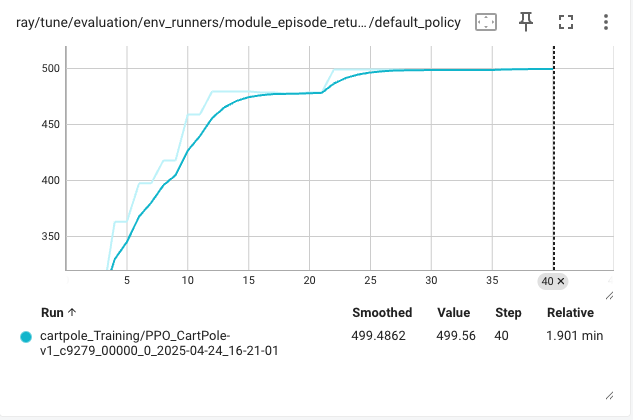
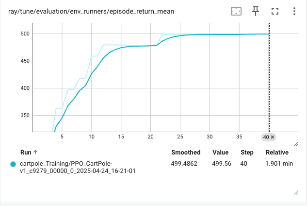
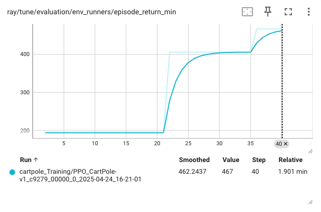

# PPO Training on CartPole-v1 with Ray RLlib

## Description
This repository contains a Python script that trains a Proximal Policy Optimization (PPO) agent on the [CartPole-v1 environment](https://gymnasium.farama.org/environments/classic_control/cart_pole/) using [Ray RLlib](https://docs.ray.io/en/latest/rllib/index.html). The CartPole task requires balancing a pole on a cart by applying forces, with a maximum episode length of 500 steps. The script uses Ray Tune to manage training and logs results for analysis. This README focuses on analyzing the training results, highlighting key achievements, and providing deployment instructions.

## Hyperparameters
The PPO algorithm is configured with carefully selected hyperparameters to ensure stable and efficient learning:

| Parameter                     | Value                     |
|-------------------------------|---------------------------|
| **Environment**               | CartPole-v1               |
| **Framework**                 | PyTorch                   |
| **Gamma**                     | 0.99                      |
| **Learning Rate**             | 0.0001                    |
| **Entropy Coefficient**       | 0.02                      |
| **Model**                     | Two hidden layers [256, 256], ReLU activation |
| **Train Batch Size**          | 4096                      |
| **Number of SGD Iterations**  | 5                         |
| **SGD Minibatch Size**        | 64                        |
| **Evaluation Interval**       | 2                         |
| **Evaluation Duration**       | 10                        |
| **Exploration (Evaluation)**  | Disabled                  |

These settings promote exploration early in training (via the entropy coefficient) and ensure stable policy updates (via a small learning rate and multiple SGD iterations).

## Results Analysis
The training results provide a comprehensive view of the PPO agent’s learning process. Below is a detailed analysis of the three key metrics: default policy performance, mean episode return, and minimum episode return, based on a training run completed on 2025-04-24 at 16:21:01.

### 1. Default Policy Performance

- **Plot Description**: Tracks the episode return over 40 training steps. The x-axis represents steps (0 to 40), and the y-axis shows the reward, ranging from ~350 to 500.
- **Observations**:
  - The episode return starts at ~350, indicating the agent can balance the pole for a moderate duration initially.
  - By step 15, the return increases to ~450, reflecting rapid policy improvement.
  - After step 25, the return stabilizes near 500, the maximum reward for CartPole-v1, where the pole is balanced for the full 500 steps.
  - A smoothed line confirms this trend, with a final value of 499.4862, nearly identical to the maximum.
  - The training duration is ~1.901 minutes, indicating high efficiency.
- **Insights**:
  - The rapid increase in reward within the first 15 steps suggests effective exploration and learning, likely aided by the entropy coefficient of 0.02.
  - Stabilization at 500 indicates the agent has converged to an optimal policy.
  - The short training time underscores PPO’s sample efficiency and the scalability of Ray RLlib.

### 2. Mean Episode Return

- **Plot Description**: Shows the mean episode return over 40 runs. The x-axis represents runs (0 to 40), and the y-axis shows the mean return, ranging from ~350 to 500.
- **Observations**:
  - The mean return begins at ~350 and rises steadily, with significant gains between runs 5 and 20, reaching ~450.
  - By run 25, the mean return plateaus at ~500, indicating consistent performance across episodes.
  - The smoothed line shows a clear upward trend, with a final value of 499.4862.
- **Insights**:
  - The mean return’s steady increase reflects the agent’s ability to generalize its policy across episodes.
  - Convergence to 499.4862 by run 25 suggests the agent has learned a near-optimal strategy, balancing the pole for the maximum episode length in most cases.
  - Minor fluctuations between runs 10 and 20 indicate variability during learning, which is expected as the agent explores different actions.

### 3. Minimum Episode Return

- **Plot Description**: Tracks the minimum episode return over 40 runs. The x-axis represents runs (0 to 40), and the y-axis shows the minimum return, ranging from 0 to ~462.
- **Observations**:
  - The minimum return starts at 0, indicating some episodes fail completely (the pole falls quickly) in early training.
  - From run 15 to 40, the minimum return rises sharply, reaching 462.2437 (smoothed) by the end.
  - The raw value peaks at 467, showing the worst-case episode still performs well.
- **Insights**:
  - The initial low minimum return suggests that early policies were inconsistent, with some episodes performing poorly.
  - The sharp increase after run 15 indicates the agent reduces poor-performing episodes, learning a more robust policy.
  - A final minimum return of 462.2437 means even the worst episodes achieve a high reward, though there’s more variability compared to the mean return, suggesting occasional suboptimal actions.

### Key Achievements
The training results demonstrate several notable accomplishments:
- **Near-Optimal Performance**: The agent achieves a mean return of 499.4862, effectively the maximum possible in CartPole-v1, indicating it consistently balances the pole for the full 500 steps in most episodes.
- **Improved Robustness**: The minimum return reaches 462.2437, a significant improvement from 0, showing that even the worst episodes perform well, though there’s room for further consistency.
- **Rapid Convergence**: Significant improvements occur within 15-25 iterations, with the policy stabilizing by run 25. The entire training process completes in ~1.901 minutes, showcasing PPO’s efficiency.
- **Algorithm Stability**: PPO’s clipped policy updates and the chosen hyperparameters (e.g., small learning rate, large batch size) ensure a smooth learning curve with minimal instability.
- **Effective Framework**: The use of [Ray RLlib](https://docs.ray.io/en/latest/rllib/index.html) and Ray Tune enables efficient distributed training, contributing to the short training time and ease of experimentation.

### Technical Insights
- **Hyperparameter Impact**: The learning rate of 0.0001 and entropy coefficient of 0.02 strike a balance between stable updates and sufficient exploration. The large neural network (two 256-unit layers) provides ample capacity for the CartPole task.
- **Exploration vs. Exploitation**: The entropy coefficient encourages exploration early on, as seen in the initial variability in returns. As training progresses, the agent exploits learned strategies, leading to consistent high returns.
- **Evaluation Strategy**: Evaluating every 2 iterations for 10 episodes provides frequent performance checks, ensuring reliable metrics without slowing training.
- **Variability in Minimum Return**: The minimum return of 462.2437 suggests that while the policy is robust, there are occasional episodes where the agent fails to balance the pole for the full duration. This could be addressed by increasing the `evaluation_duration` or tuning the entropy coefficient.

### Broader Implications
- **Reinforcement Learning Context**: CartPole-v1 is a foundational environment for testing RL algorithms. Achieving a mean return of 499.4862 confirms the PPO implementation’s effectiveness.
- **PPO’s Strengths**: The results align with PPO’s reputation as a stable and sample-efficient algorithm, as described in the [PPO paper](https://arxiv.org/abs/1707.06347). PPO’s clipped objective function prevents large policy updates, contributing to the smooth learning curve observed.
- **Scalability Potential**: While CartPole is simple, the methods used here (PPO with Ray RLlib) are applicable to more complex tasks, such as robotics or game playing, demonstrating the framework’s versatility.

## Deployment
The trained model can be deployed without Ray RLlib using the provided `model_weights.pt` file and `inference.py` script, both available in this repository. The model weights were extracted from the final checkpoint (`checkpoint_000040`) after 40 training iterations, achieving a mean return of 499.4862.

### Steps to Deploy the Model
1. **Ensure Dependencies**:
   - Python 3.10+
   - PyTorch 2.5.1
   - Gymnasium (for CartPole-v1 environment): `pip install gymnasium`
   - NumPy: `pip install numpy`

2. **Download Files**:
   - Ensure `model_weights.pt` and `inference.py` are in your working directory. These files are included in the repository.

3. **Run Inference**:
   - Execute the inference script to test the model in the CartPole-v1 environment:
     ```bash
     python inference.py
     ```
   - The script will run the model for 5 episodes by default, printing the total reward for each episode and the average reward. You can modify the `episodes` parameter in the `test_model()` function to run more episodes.

### Expected Performance
The deployed model should achieve an average reward close to 499.4862 per episode, reflecting the trained policy’s ability to balance the pole for the maximum episode length of 500 steps. Occasional episodes might yield slightly lower rewards (down to 462.2437, as seen in the minimum return), but overall performance should be near-optimal.

### Notes
- The `inference.py` script defines a neural network with two hidden layers of 256 units each, matching the training configuration (`fcnet_hiddens=[256, 256]`).
- The model runs in deterministic mode, selecting the action with the highest logit for each observation, suitable for deployment scenarios.

## Component Versions
The following versions were used for training and deployment:
- **Python**: 3.10+
- **Ray RLlib**: 2.44.1+
- **PyTorch**: 2.5.1

Ensure your environment matches these versions for compatibility, though newer versions may also work with minor adjustments.

## Conclusion
The PPO agent’s training on CartPole-v1 is highly successful, achieving a near-optimal mean return of 499.4862 and a minimum return of 462.2437. The rapid learning within ~1.901 minutes, improved robustness, and stable training process highlight the strengths of PPO and the Ray RLlib framework. The provided deployment scripts allow users to easily test the trained model, making this project a strong foundation for applying similar techniques to more challenging reinforcement learning problems.

## References
- [Ray RLlib Documentation](https://docs.ray.io/en/latest/rllib/index.html)
- [CartPole-v1 Environment](https://gymnasium.farama.org/environments/classic_control/cart_pole/)
- [PPO Paper](https://arxiv.org/abs/1707.06347)

## Contact
For questions or feedback, please contact faiq.shamass@gmail.com.