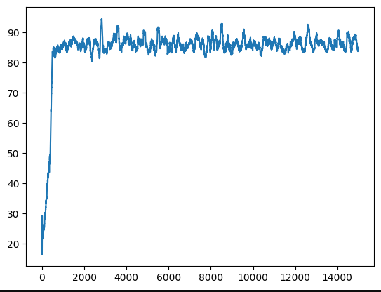

# Q-Table implementation for Gym CartPole
#### Simple script to demonstrate the Q-Table learning with Gym CartPole simulation using discretization https://gymnasium.farama.org/environments/classic_control/cart_pole/
RL Client learning using discretization of GYM simulation CartPole continuous state.
Agent was able to learn and reached around average of 85 rewards (steps).
Below is plot of agent rewards during learning process.

  

  
  
Learned Rewards

