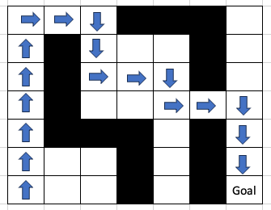

# SARSA Implementation

This directory contains the SARSA (State-Action-Reward-State-Action) algorithm implementation and a gorge walking example using the environment from `../../env/gorge-walking`.

## Prerequisites

Before building this project:
1. First build the gorge-walking environment library:
```bash
cd ../../env/gorge-walking
mkdir build && cd build
cmake ..
make
```

## Build Instructions

1. Create and enter the build directory:
```bash
mkdir build
cd build
```

2. Configure CMake:
```bash
cmake ..
```

3. Build the library and executable:
```bash
make
```

This will create:
- `lib/libsarsa.dylib` (or `.so` on Linux) - The SARSA algorithm library
- `gorge_walking` - Executable demonstrating SARSA on the gorge walking environment

## Directory Structure After Build

```
SARSA/
├── lib/
│   └── libsarsa.dylib        # SARSA library
├── gorge_walking             # Main executable
├── sarsa.cpp
├── sarsa.hpp
├── gorge_walking.cpp
├── CMakeLists.txt
└── build/
    └── ...
```

## Running the Example

From the SARSA directory:
```bash
./gorge_walking

# Run with custom number of episodes
./gorge_walking 500
```

### Command-line Arguments

- `[num_episodes]`: Optional. Number of training episodes (default: 100)
  - Must be a positive integer
  - Examples: `./gorge_walking 200`, `./gorge_walking 1000`

## Example Results

Training the SARSA agent on the gorge walking environment (as defined in [env/gorge-walking/main.cpp](../../env/gorge-walking/main.cpp)) with 700 episodes produces excellent results. The learned policy successfully navigates around the gorge obstacles to reach the goal:

```bash
./gorge_walking 700
```

### Learned Policy

After training, the agent learns the following policy (XX = gorge/obstacle, G = goal):

```
----------------------------------
RT | RT | DN | XX | XX | XX | RT |
----------------------------------
UP | XX | DN | DN | LT | XX | RT |
----------------------------------
UP | XX | RT | RT | DN | XX | UP |
----------------------------------
UP | XX | UP | RT | RT | RT | DN |
----------------------------------
UP | XX | XX | XX | UP | XX | DN |
----------------------------------
UP | RT | RT | XX | DN | XX | DN |
----------------------------------
UP | DN | DN | XX | DN | XX |  G |
----------------------------------
```

Where:
- `UP` = Move up
- `DN` = Move down
- `LT` = Move left
- `RT` = Move right
- `XX` = Gorge (obstacle/danger)
- `G` = Goal

A visual depiction of the final learned policy is shown below:
<div align="left">
  <br>
  
  <p>Gorge Solution</p>
</div>

## Troubleshooting

If you get library loading errors:
1. Make sure you've built the gorge-walking environment first
2. Verify both libraries exist:
   - `../../env/gorge-walking/lib/libgorge_walking_env.dylib`
   - `./lib/libsarsa.dylib`
3. If needed, set `DYLD_LIBRARY_PATH` (macOS) or `LD_LIBRARY_PATH` (Linux):
```bash
# macOS
export DYLD_LIBRARY_PATH="$PWD/lib:$PWD/../../env/gorge-walking/lib:$DYLD_LIBRARY_PATH"

# Linux
export LD_LIBRARY_PATH="$PWD/lib:$PWD/../../env/gorge-walking/lib:$LD_LIBRARY_PATH"
```