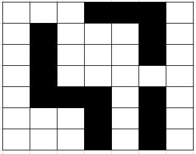

# Gorge Walking (C++)

This folder contains a generalized C++ implementation of a "gorge walking" grid-world environment inspired by OpenAI Gym's CliffWalking. It is designed for exploration and experimentation and adds flexibility compared with the classic example:

- Configurable grid size (rows × columns)
- Configurable gorge/danger cells (a list of coordinates)
- Optional stochastic (slippery) dynamics

The environment exposes a simple, gym-like API so it is easy to plug into learning agents.

## What changed compared to the classic example

- The environment constructor now accepts grid dimensions and a list of gorge coordinates so you can define arbitrary danger shapes.
- The API follows gym conventions: `reset()` returns the initial observation (state), and `step(action)` returns `(next_state, reward, done, truncated)`.
- The implementation compiles to a shared library and includes a small demo executable.

## Public API (summary)

- `GorgeWalkingEnv(int numRows, int numCols, std::vector<std::pair<int,int>> gorge, float slipProb = 0.0)`
   - Create an environment of size `numRows × numCols`, mark the coordinates in `gorge` as danger cells, and set slip probability.

- `std::pair<int,int> getObservationSpace()`
   - Returns the min/max integer observation values (useful for discretized agents).

- `std::pair<int,int> getActionSpace()`
   - Returns the min/max action indices (0..3 for UP/RIGHT/DOWN/LEFT).

- `std::vector<std::string> getActionNames()`
   - Human-readable action names.

- `int reset()`
   - Reset environment and return initial state.

- `std::tuple<int,int,bool,bool> step(int action)`
   - Apply `action`, return `(next_state, reward, done, truncated)`.

Refer to the header (`gorge_walking.hpp`) for exact function signatures and to the implementation (`gorge_walking.cpp`) for reward magnitudes and truncation policy.

## Build

This project uses CMake. From this folder:

```bash
mkdir -p build && cd build
cmake ..
make
```

This will produce:

- A shared library (e.g. `libgorge_walking_env.dylib` or `.so`) in `../lib/` (CMake config creates this folder if needed)
- A demo executable (name depends on the CMake target) placed in the package directory

You can also compile manually for quick tests (not recommended for repeated builds):

```bash
g++ -std=c++17 -O2 main.cpp gorge_walking.cpp -o gorge_walking
```

## Run demo

From the gorge-walking directory run the demo executable (name depends on build; check `build/` or the CMakeLists target name). Example:

```bash
./gorge_walking         # or ./gorge_walking_demo depending on build
```

The demo shows basic interaction with the environment and prints transitions and rewards.

## Example usage

<div align="left">
  <br>
  
  <p>Example Gorge</p>
</div>

```cpp
// create a 7x7 grid with a gorge shown in image above with no slippage
std::vector<std::pair<int,int>> gorge = 
{{1,1},{2,1},{3,1},{4,1},{4,2},{4,3},{5,3},{6,3},{0,3},{0,4},{0,5},{1,5},{2,5},{4,5},{5,5},{6,5}};
GorgeWalkingEnv env(7, 7, gorge);
int s = env.reset();
auto [ns, r, done, truncated] = env.step(1); // take action 1 (RIGHT)
```

## Notes on semantics

- Default step reward is negative (encourages shorter paths).
- Entering a gorge cell yields a larger negative penalty and terminates the episode.
- Hitting an invalid cell (out of bounds) keeps the agent in place and counts as a step (see implementation for exact reward behavior).
- Slip probability makes the chosen action sometimes replaced by a random action.

## Troubleshooting

- If you get linker errors when running an executable, ensure the library path includes `../lib/` (set `LD_LIBRARY_PATH` or `DYLD_LIBRARY_PATH` as appropriate).
- If the demo doesn't compile, verify C++17 and CMake versions.

## Contributing

If you extend the environment, please:

- Update this README to reflect public API or behavioral changes
- Add a small example in `main.cpp` demonstrating the new feature
- Keep changes focused and testable
